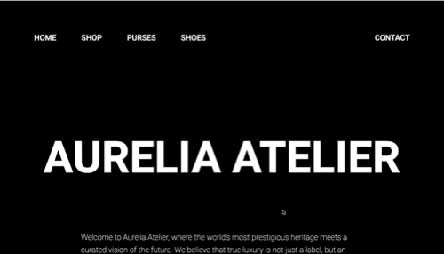

# Luxury Image Reveal Website

An interactive, high-end web experience exploring different clip-paths generated by AI featuring different image reveal animations for every brand. This project blends manual CSS craftsmanship with AI-assisted path generation to create a unique visual journey through luxury brands.

## ✍️ Author

| Icon | Name | Profile |
| :--- | :--- | :--- |
| 👩‍💻 | **Jacqueline** | [@jdbostonbu-ops](https://github.com/jdbostonbu-ops) |

## 🚀 Live Demo
[View the project live here:](https://jdbostonbu-ops.github.io/image-reveal-project/)

  
   
  
<em>Demonstrating AI-generated clip-path geometries and seamless polygon transitions.</em>

## 🌐 Browser & Device Compatibility

This project is built to handle modern CSS `clip-path` rendering. For the best visual experience, please refer to the support chart below:

| Platform | Browser / Device | Status | Notes |
| :--- | :--- | :--- | :--- |
| **Desktop** | Google Chrome | ✅ Supported | Full animation support |
| **Desktop** | Microsoft Edge | ✅ Supported | Optimized for Chromium |
| **Desktop** | Safari | ✅ Supported | Smooth path transitions |
| **Desktop** | Mozilla Firefox | ✅ Supported | Full layout compatibility |
| **Tablet** | iPad | ✅ Supported | High-resolution optimized |
| **Mobile** | iOS / Android | ⚠️ Partial | **Must zoom out to 50%** to view full layout |

> **User Note:** Because this site prioritizes large-scale "Luxury" visuals and complex reveal geometries, mobile users should manually set their browser zoom to **50%** to see the intended full-page composition.

## 🧠 The Creative Process
This project features a unique collaboration between human design and AI:
1. **The Foundation**: I manually authored the initial set of complex CSS `clip-path` from a YouTube tutorial using clip-paths generated by (https://unused-css.com/tools/clip-path-generator)
2. **AI Scaling**: I then utilized AI to generate a diverse `clip-paths` geometries, allowing for unique reveal animations across every brand page (Dior, Chanel, Fendi, etc.).

## ✨ Project Highlights
- **Hybrid Animation**: Custom-designed clip-paths expanded by AI for varied image reveal effects.
- **High-End Aesthetic**: A consistent deep-black theme (`#000`) designed to showcase luxury products like Bottega Veneta and Cartier.
- **High-End Shutterstock Images**: A seamless bridge between static HTML navigation and dynamic React components (`home.jsx`).
- **React Integration**: A seamless bridge between static HTML navigation and dynamic React components (`home.jsx`).

## 🛠️ Tech Stack
- **Library & Frontend:** React.js (JSX) — Component-based UI architecture.
- **Styling**: Advanced CSS3 (Clip-Paths and polygon Clip-Path Transitions)
- **Architecture**: Modular HTML5 entry point with Vite/Module support: Vite (Lightning-fast HMR)
- **Design Tools**: AI-assisted geometry generation.
- **Library**: React.js (Component-based UI)
- **Environment**: Node.js & npm (Dependency Management)
- **Design Tools**: AI-assisted geometry generation

## 📨 Serverless Contact Architecture
The **Aurelia Atelier** contact panel utilizes a modern, serverless approach to handle luxury inquiries:
- **Asynchronous Data Transmission**: Built with the **Fetch API** using `async/await` patterns to ensure a zero-refresh user experience.
- **Web3Forms Integration**: A secure, serverless backend bridge that captures boutique inquiries without a dedicated mail server.
- **Dynamic UI State Logic**: Leverages React `useState` to swap the interface from a functional form to a cinematic "GRAZIE" success state upon confirmation.

## 🚀 Key Features
- **Dynamic Reveal**: Images don't just appear; they "unfold" using custom geometric paths.
- **Luxury Brand Directory**: Comprehensive navigation for high-end Purses, Shoes, and Collections.

## 🎓 Lessons Learned

## ⚛️ React vs. Vanilla Logic
One of the biggest takeaways was the importance of handling form data within the **React Lifecycle**. Transitioning from a standard `document.getElementById` script to a React-specific `onSubmit` handler using `event.currentTarget` taught me how to manage state (`isSubmitted`) alongside asynchronous API calls.

## 🧩 Procedural Geometry
Working with AI to scale **CSS Clip-Paths** taught me how to bridge the gap between algorithmic generation and manual UI design. I learned how to "direct" AI to create functional polygon paths that remain performant while providing a luxury, non-standard visual reveal.

## 📦 Asset Optimization
Optimizing the project's visual demos taught me the balance between **high-fidelity visuals and page performance**. By mastering the conversion from `.mov` recordings to optimized `.gif` files, I was able to showcase complex animations without compromising the repository's load time.
